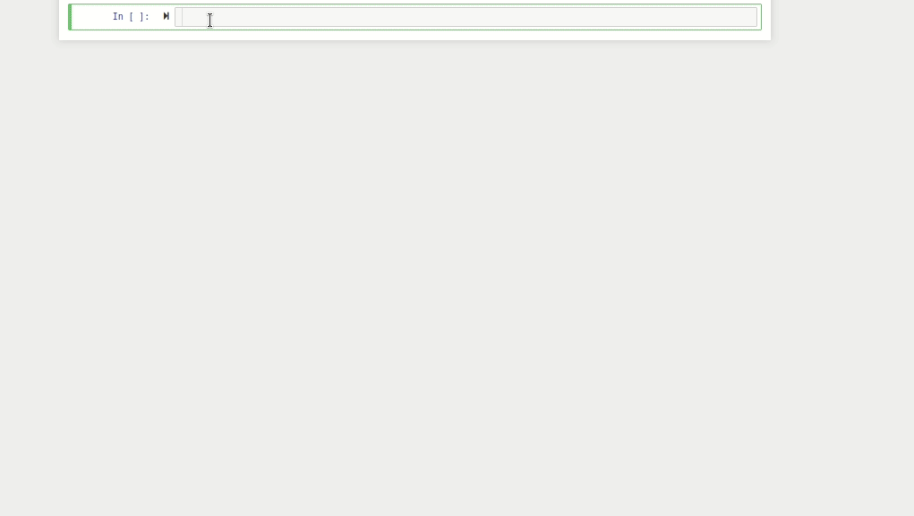

# counterfactuals 

In order to build the widget, run 
``` 
cd ccwidget 
pip install -e . 
source build.sh 
``` 
Then, load the appropriate data and execute the commands (look [this file](https://github.com/tiagodsilva/counterfactuals/blob/main/ccwidget/ccwidget/CFOverview.py) for some documentation) 
```py 
import ccwidget 
overview = ccwidget.CFOverview(cfa, dist, cfr_cfs, projection)  
overview.widget 
``` 
as shown in the GIF. 
 
